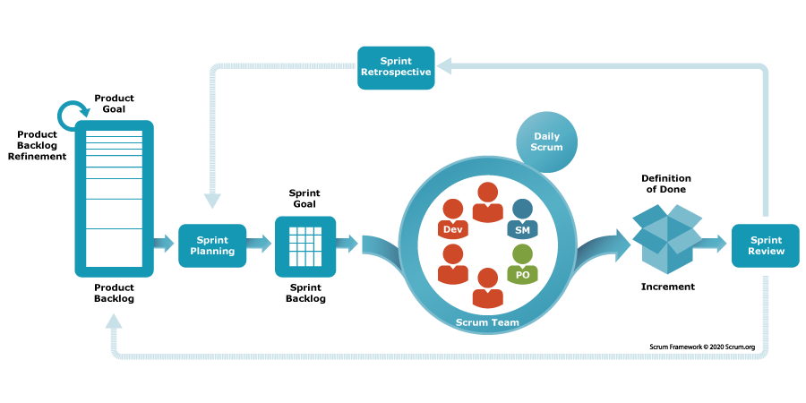
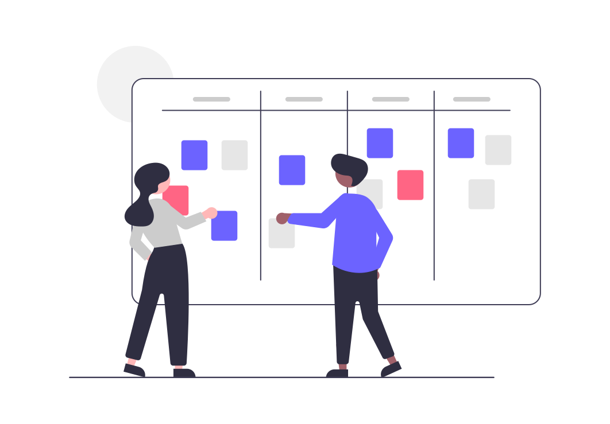

::::::::::::::::::::::::::::::::::::::: objectives

FIXME

::::::::::::::::::::::::::::::::::::::::::::::::::

:::::::::::::::::::::::::::::::::::::::: questions

- How is the Agile methodology used in practice?
- What are the features of various Agile frameworks?

::::::::::::::::::::::::::::::::::::::::::::::::::

## Scrum

**Scrum** (and its variants) is one of the most widely used Agile frameworks.
Scrum is a lightweight process that aims to break work into time-boxed iterations.

{alt='The Scrum Process - from Product goal to Sprint review'}

### Project Vision

In the initial phase, project envisioning takes place.
How long this takes depends on the scope of the project and may take as much as 2-4 weeks.

During project envisioning, the client and the team define the following at high-level:

- **A project vision**: what the project is intended to accomplish.
  This should be no longer than a few pages at most (and often  times is much shorter).
- **A project backlog**: a list of key features to be implemented.
  In envisioning, the features tend to be high-level and broad
    - Typically expressed as "User Stories"
    - Future efforts will refine the details
- **An initial roadmap**: a series of releases that include features in the backlog 
    - The first release should be the "Minimal Viable Product"

::::::::::::::::::::::::: callout

#### Requirements as User Stories

User stories are created by describing software features or capabilities from a user's point of view.
This can be from the perspective of either regular user s or an administrator.
They are written in "story" form.
Here are some examples: 

- "As a user, I can view my data"
- "As a user, I can edit my data"
- "As an administrator, I can change the access rights of a user"

Here are some examples of user stories for non-functional requirements, though
they may not become separate tasks:

- "The system is robust against changes in the database format"
- "The system responds to a database commit in less than 50 ms"

:::::::::::::::::::::::::::::::::

After project envisioning is completed, development occurs in a series of
time-boxed iterations (1 week to 4 weeks) called sprints or iterations.

### Sprint Planning

Sprints start with a planning meeting, time-boxed to 1 hour per week. 
For example,for a 4-week sprint, the planning meeting may be no longer than 4 hours.
The developers choose features from the project backlog to be implemented in the sprint.
Larger features are decomposed into smaller features and details are discussed.
Feature priority is determined by the client and the team, based on relevance
to the product roadmap, risk/uncertainty, level of difficulty, etc.
Implementation cost of the features is determined by the developers.
The developers then commit to completing those tasks within the sprint.

:::::::::::::::::::::: callout

## Defining the Work

In Scrum, the project backlog is the specification of what work remains to be done on the project. 
User stories are descriptions of features that can be implemented within a single sprint.
Epics are features that will require multiple sprints to complete.
Epics contain user stories that correspond to the epic.

Bugs are defined as software defects encountered in completed work.
Periodically, backlog grooming occurs.
This is when stories and epics that are no longer relevant to the project are
removed (e.g. because a requirement was later found to be unnecessary).

::::::::::::::::::::::::::::::

### Sprint Work

The Scrum team then completes their work throughout the sprint period.
They meet for daily stand-up meetings (generally 15 minutes) in which they discuss
what they did yesterday, what they plan to do today, and any blockers or issues
that may have occurred.

### Sprint Review

At the end of the sprint is a sprint demo and a retrospective discussion.
This tends to be a short meeting or is first part of next sprint's planning
meeting where completed work is demonstrated to the client / stakeholders.
Remember, Agile places high priority on working software and customer collaboration.

Everyone discusses lessons learned in the sprint, such as what unexpected issues
had to be dealt with and what can be done better in future sprints.
A sprint may include releasing/deploying software, or it may not. 
This depends on where the team is with respect to the product roadmap.

## Agile vs. Waterfall

Agile does requirements gathering and design incrementally, mostly just before implementation.
Overall, Agile may be more costly than a well-executed waterfall approach, as
long as requirements and design don't change!

{alt='A graph of project lifetime vs. effort for agile and waterfall'}

## Other Agile Methodologies

### Kanban

Japanese for "Board," Kanban is a lightweight method for tracking work on a project.
While it was originally done using a board marked into four columns and Post-It notes,
it integrates well with GitHub.
Kanban is typically best for small to medium size projects.

{alt='Two team members addressing a Kanban board with four columns.'}

### MoSCoW

MoSCoW is a lightweight technique for prioritizing work typically done in the sprint planning meeting.
This meeting's focus is on the next software release/sprint.

MoSCoW stands for: 
- Must have
    - Without this, we don't have a useable release
- Should have
    - The release would be less valuable or compelling without this, but would still be worth releasing
- Could have
    - Nice to have, but not essential
- Won't have
    - Maybe not ever, but too much for this time

The priority of the sprint is to work first on **Must Haves** and then **Should Haves** (if there
is time remaining in the sprint).

::::::::::::::::::::: challenge

:::::::::::::::::::::::::::::::

:::::::::::::::::::::::::::::::::::::::: keypoints

- FIXME

::::::::::::::::::::::::::::::::::::::::::::::::::
